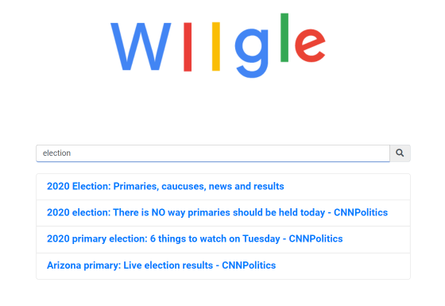

# query-suggestion-service

## Overview

### Azure Cloud Service Worker Role Implementation

The Worker Role parses the www.cnn.com/robots.txt file to add sitemaps and urls to the appropriate queues (xmlQueue for xml files, htmlQueue for html files), both of which continously enqueues respective urls. The crawler implementation includes cache, which checks and prevents duplicate links from being processed again. Every url that is crawled is within the domain of cnn.com, and the crawler also keeps track of the errors and exceptions that are caught which are then stored in the error table.
